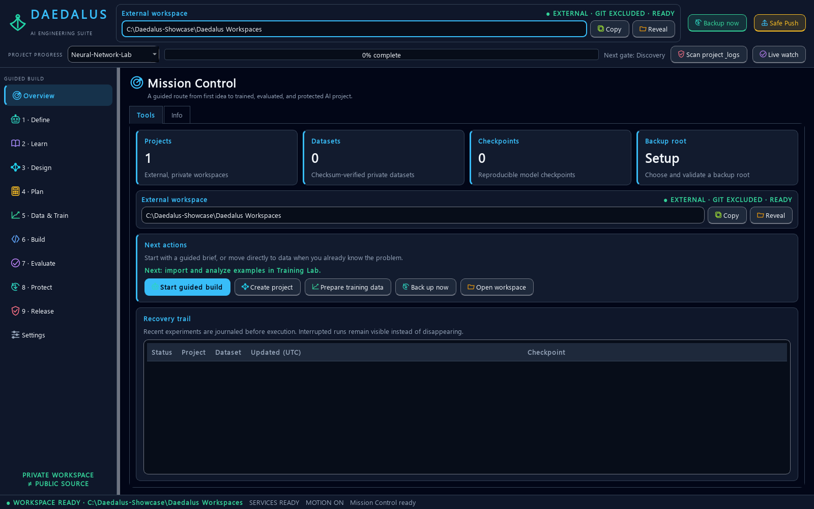

# Daedalus A.I. Engineering Suite

Daedalus is a free, local-first desktop workbench for learning how neural
networks work by building them from NumPy primitives. It combines a transparent
autograd engine, architecture and memory calculators, guided lessons, a training
lab, an adaptive 3D model viewer, evidence-based project progress, live project
diagnostics, professional project/reproducibility setup, held-out model evaluation,
a project editor, a crash-resumable AI Developer Bot, safe workspace management,
verified backup/restore, and guarded GitHub publishing in one native control center.



The core learning engine intentionally does **not** use PyTorch or TensorFlow.
NumPy supplies array primitives; Daedalus implements the computation graph,
backpropagation, layers, losses, optimizers, training loop, and diagnostics.
The advanced teaching layer adds deterministic dropout, layer normalization,
embeddings, causal multi-head self-attention, and a pre-normalized Transformer
block while keeping every operation inspectable.

## Quick start on Windows

1. Double-click `Install-Daedalus.bat`.
2. Launch the desktop shortcut **Daedalus AI Engineering Suite**.
3. Create a private project in **Overview**, then follow the numbered left rail:
   begin with **1 · Define**, or open **2 · Learn** for the XOR learning path.

The installer creates an isolated virtual environment, installs all runtime and
release-guard dependencies, creates shortcuts, initializes the external user
workspace, and can register the safe F: backup task. Python 3.11+ and Git are
installed through Windows Package Manager when absent.

The primary shortcut targets the branded `Daedalus.exe` launcher in this folder.
`Run-Daedalus.bat` remains a compatible fallback, and maintainers can rebuild the
native launcher from its reviewed C# source with `tools\build-launcher.ps1`.

## Safety boundaries

- Public source lives in this folder; user work defaults to
  `%USERPROFILE%\\Daedalus Workspaces`, outside the Git repository and outside
  Windows' commonly protected Documents folder.
- Projects, datasets, checkpoints, logs, credentials, model files, and local
  settings are blocked by both repository policy and pre-push inspection.
- Checkpoints are non-executable `.npz` arrays plus validated JSON metadata.
- The code runner is a time- and path-confined subprocess, not a virtual machine.
  Treat untrusted code as untrusted and use a real VM for hostile samples.
- Safe Push scans exact staged blobs with a SHA-256-pinned Gitleaks binary, then
  runs privacy, size, syntax, Ruff, test, dependency, and outgoing-history gates.
  Unresolved blocking findings stop the commit or push; force pushes are refused.
- Backup and GitHub publication are independent: private projects can be backed
  up to F: without ever being staged for GitHub.
- The AI Developer Bot is an offline deterministic expert system—not a hosted
  language model. It needs no API key, makes no network calls, executes no code,
  and records accepted answers as checksummed append-only revisions.
- Backup manifests inventory every copied file by SHA-256. Live SQLite files use
  a consistent online snapshot, and restores are restricted to a new directory.

## Included workspaces

The left rail is an ordered, beginner-friendly build path. Numbered stages descend
from **Define** through **Release**, and every stage uses the same contract:
**Tools** for doing the work and **Info** for understanding the concepts, evidence,
and safety boundaries. **Overview** reports the next useful action and recent run
state; it is not a duplicate build step. The Define stage also has a **Setup** tab
for the cross-cutting project environment and reproducibility baseline.

- **Persistent project guide**: choose the active project from any page, see progress
  across ten saved evidence gates, scan code/logs/data/checkpoints on demand, or keep
  near-real-time change monitoring enabled.
- **Mission Control**: status, paths, recent runs, next action, and quick actions.
- **AI Developer Bot**: Beginner/Builder/Expert guidance through discovery,
  recovery, data, baseline, architecture, experiment, evaluation, deployment,
  security, and release gates; resumable sessions, non-overwriting project plans,
  an offline setup audit, optional-tool detection, and environment capture.
- **Learning Atlas**: 10 beginner-to-advanced tracks, 21 checkpoint modules, a
  searchable four-mode glossary, Error Clinic, project recipes, and curated
  official/primary sources with offline summaries.
- **Architecture Builder**: assemble dense networks, validate every shape, and rotate,
  zoom, or inspect a capability-adaptive 3D representation with a software fallback.
- **Calculator Lab**: dense-network memory plus convolution, attention/Transformer,
  quantization, batch/step, and training-time planners with visible assumptions;
  its Weight Lab adds six bounded hypernetwork, logic, recurrent-state,
  physics-constraint, ELM, and active-learning prototypes with per-tool private
  sandboxes and current research/video-search help.
- **Training Lab**: checksum-verified numeric CSV intake, bounded data-quality
  analysis, deterministic stratified train/validation/test splits, train-only
  feature standardization, early stopping, held-out metrics, run journaling, and
  reconstruction-ready checksummed checkpoints. Runs record compact runtime/code
  provenance; project runs also receive an immutable, redacted evidence manifest.
- **Code Workshop**: protected project tree, editor, templates, constrained runner,
  and redacted project-local execution events for live or later diagnostics.
- **Model Evaluator**: safely reconstruct a completed checkpoint, replay its exact
  validation or final-test split, report confusion/per-class or residual metrics,
  compare a declared baseline, apply a promotion threshold, and save an immutable report.
- **Release Guard**: local advisory scan, privacy checks, reports, and guarded push.
- **Vault & Backup**: F: backup status, verification, retention, and restore guidance.

Every Info tab includes an explicit, stage-specific YouTube search link. It opens
only when activated and sends no project data in the search query.

## Command-line development

```powershell
py -3.12 -m venv .venv
.\.venv\Scripts\python.exe -m pip install -r requirements-dev.txt
.\.venv\Scripts\python.exe -m pip install --no-deps -e .
.\.venv\Scripts\python.exe -m pytest
.\.venv\Scripts\python.exe tools\benchmark_gui.py
.\.venv\Scripts\python.exe -m daedalus
```

The optional GUI benchmark runs offscreen and prints comparable JSON for startup,
first paint, cold page visits, deferred tools, large-editor ingestion, 3D frame
costs, resize handling, and unchanged appearance updates. It is intentionally
separate from unit tests so machine load does not create timing-test failures.

## Guarded GitHub publication

Double-click `Publish-To-GitHub.bat` for the first publication. It bootstraps
hash-verified GitHub CLI and Gitleaks tools into the ignored `.dev-tools` folder,
opens GitHub's own authentication flow, creates a public source repository, and
pushes only after the local guard passes. Afterward, use `Safe-Push.bat` for
reviewed updates. Unattended push is opt-in and is not the recommended default.

Hosted automation uses immutable action commit pins and least-privilege tokens.
CI covers supported Python/OS combinations, Ruff, compilation, tests, Release
Guard policy, and dependency audit. The security workflow adds CodeQL, full-history
Gitleaks, Bandit, dependency review, Zizmor workflow lint, and OpenSSF Scorecard. Tagged releases are
validated on `main`, generate a reproducible CycloneDX 1.7 SBOM and checksum, and
publish provenance/SBOM attestations from a separate write-enabled job.

GitHub is a public-source channel, not a private backup. `Backup-Now.bat` and the
hourly task target the marked content-addressed root at
`F:\Daedalus-Backups\DaedalusAI`; volume health, dirty state, and capacity are
checked before new data is written.

See `docs/GETTING_STARTED.md`, `docs/WEIGHT_LAB.md`, `docs/PROFESSIONAL_TOOLCHAIN.md`,
`docs/LEARNING_PATHS.md`, `docs/PROJECT_RECIPES.md`, `docs/ARCHITECTURE.md`, and
`docs/SECURITY_MODEL.md` for the detailed guides. The guides are designed so a
first-time Python learner can begin with XOR while an experienced builder can
move directly to autograd, attention, profiling, reproducibility, and release
engineering.

## Open source

Daedalus is released under the MIT License. Contributions are welcome through
issues and pull requests. Do not report security vulnerabilities publicly; use
the process in `SECURITY.md`.
