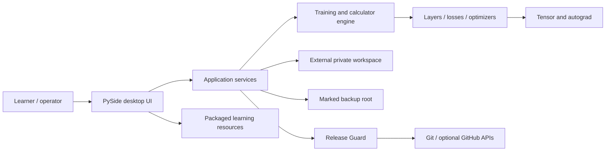

# Architecture

Daedalus separates transparent numerical code, operator services, native UI,
private learner data, and publication automation. The engine must remain usable
and testable without starting the GUI, connecting to GitHub, or mounting the
backup drive.

## System context



Network access and `F:` are optional edges. Local learning, calculators, tests,
project editing, and model inspection must remain available when both are absent.

## Design principles

1. **NumPy is a primitive, not the model framework.** Daedalus implements graph
   construction, reverse accumulation, layers, losses, optimizers, training,
   diagnostics, and serialization contracts.
2. **Dependencies point inward.** UI depends on services; services orchestrate
   engine/workspace modules; numerical modules never import GUI or GitHub code.
3. **Private data is outside public source.** The workspace manager rejects roots
   that contain, or are contained by, the source root.
4. **Persistence is non-executable and versioned.** Arrays use NPZ; metadata uses
   validated JSON with schema, shapes, dtypes, and integrity information.
5. **Automation reports before it mutates.** Backup, release, and dependency
   workflows expose dry-run or validation evidence where applicable and fail
   closed at unsafe boundaries.
6. **Learning content is data.** Tracks, glossary entries, sources, recipes, and
   error cards are packaged JSON rather than hard-coded widget text.
7. **The shell is the workflow.** The left rail presents numbered build stages;
   every stage exposes a consistent **Tools** tab and an **Info** tab. Overview
   and Settings support the process but are not presented as build steps.

## Package boundaries

| Area | Responsibility | May depend on | Must not depend on |
|---|---|---|---|
| `daedalus.core` | Tensor values, graph nodes, backward traversal, gradient shape rules | NumPy, standard library | GUI, workspace, Git, network |
| `daedalus.layers` | Module/Parameter contracts, compositions, activations, train/eval state | `core`, NumPy | GUI, backup, GitHub |
| `daedalus.losses` | Stable objectives and explicit reduction behavior | `core`, NumPy | trainer/UI state |
| `daedalus.optim` | SGD/Momentum/Adam state and updates | layer parameter protocol, NumPy | GUI, filesystem |
| `daedalus.engine` | Datasets, batching, trainer events, calculators, profiling, evaluation | numerical packages | concrete widgets, Git |
| `daedalus.workspace` | External paths, project templates, run/checkpoint metadata | standard library, NumPy for checkpoint arrays | UI internals, remote APIs |
| `daedalus.developer` | Offline stage-gated advisor, revision store, health evidence, planning artifacts, recovery proposals | workspace metadata and standard library | GUI, network, subprocess, external AI providers |
| `daedalus.services` | Sandbox runner, backup, release guard, application orchestration | workspace/engine, OS subprocess and Git boundaries | numerical implementation details |
| `daedalus.gui` | Native presentation, navigation, adaptive 3D projection, progress, commands, and live views | service and engine interfaces, resources | hidden filesystem/network mutations |
| `daedalus.resources` | Read-only packaged curriculum and diagnostics | standard-library resource loader | GUI, engine, user data |

Some target modules are delivered in stages. The dependency rules apply from the
first implementation and should be enforced in review even when a package is
temporarily small.

## Core execution flow

### Training

1. The workspace service resolves a checksum-verified data reference beneath the
   private root; raw rows are never copied into run logs.
2. The data assistant produces a bounded quality report, resolves the task, and
   creates deterministic train/validation/final-test indices. Classification is
   stratified and retains at least one training example for every class.
3. Feature standardization is fitted on training rows only, then replayed on the
   held-out partitions. The split hashes, label map, and preprocessing values form
   part of the durable training contract.
4. Engine code creates a deterministic mini-batch order from an explicit Generator.
5. Layers construct a computation graph during the forward pass.
6. A scalar loss seeds reverse mode; local rules accumulate gradients in reverse
   topological order and reduce broadcasted contributions to input shapes.
7. The optimizer validates finite, shape-matching gradients and updates registered
   parameters.
8. Validation loss can stop a run at an epoch boundary and restore the best model
   state. The untouched final-test partition is scored only after fitting.
9. The trainer emits metric events. The training service journals them; engine
   code does not call widgets.
10. Run and checkpoint metadata record configuration, seed, data/split identity,
    full layer dimensions, preprocessing, label map, stop reason, held-out metrics,
    compact Python/NumPy/Daedalus/platform evidence, project source/config hashes,
    and non-executable checkpoint references. A real project also receives an
    immutable redacted run manifest with full bounded environment evidence.

### Evaluation

The evaluator accepts only a completed Run Registry record and its checksummed Daedalus
NPZ/JSON checkpoint. It reconstructs allowlisted layers, replays the recorded deterministic
split and train-only preprocessing, batches inference within explicit limits, and writes a
new immutable report under the matching private project. Classification reports include a
confusion matrix and per-class precision/recall/F1; regression reports include RMSE, MAE,
R², and residual quantiles. Direction-aware thresholds and baseline comparisons produce an
explicit acceptance decision. Project code is never imported and pickle is never enabled.

### Project standards

New projects are populated inside the manager's unpublished staging directory with a
`pyproject.toml`, exact installed-environment inventory, smoke test, configuration, card
templates, Git policy, and deployment/observability contracts. Existing projects can create
only missing files transactionally. The read-only setup inspector fingerprints bounded
source, validates declared requirements, captures a redacted runtime snapshot, and detects
optional frameworks or tools without importing them, installing software, contacting an
account, or making a network request.

### AI Developer Bot

1. A typed project brief seeds one canonical session under the private workspace.
2. The deterministic advisor evaluates ten ordered gates from discovery through
   protected recovery, data/model work, security, and release.
3. Each accepted answer is appended as a checksummed SQLite revision; corrupt
   heads can recover to the newest valid committed revision.
4. Health inspection is bounded, read-only, and non-executable. It inventories
   the actual run registry, checkpoint hashes, source policy, and backup manifest.
5. Generated project specifications, cards, plans, threat models, runbooks, and
   reproducibility data use fixed names and refuse to overwrite existing files.
6. Recovery planning validates a nonexistent destination outside all protected
   roots. Only Vault & Backup may perform the later explicit restore.

### Checkpoint

Named parameter arrays are written to a temporary NPZ, hashed, and paired with
JSON metadata. Load validates format/schema, checksum, key order, parameter count,
shape, and dtype before copying into an existing compatible model. Object arrays
and pickle loading are forbidden.

### Project execution

The Code Workshop asks the workspace manager to resolve a Python file beneath
`projects`. The constrained runner parses it, applies learning-policy checks, and
starts an isolated Python subprocess with a bounded working directory, minimal
environment, captured output, and timeout. This protects against ordinary
mistakes, not hostile code; see [SECURITY_MODEL.md](SECURITY_MODEL.md).

### Weight Lab

Weight Lab lives inside Calculator Lab so it expands planning capability without
changing the numbered build lifecycle. Six pure NumPy engine functions own the
mathematics and return typed arrays plus deterministic `WeightToolRecord`
evidence. The GUI owns parsing and presentation only. It uses one shared
point-to-line-to-window reveal host and binds the opened tool to three shared
modes: Guided, Sandbox, and More Info.

Sandbox starters are previewed in memory. An explicit exclusive create places a
draft at `projects/<project>/experiments/weight_lab/<tool_key>.py`; later saves
are atomic. The verified catalog is immutable, project code is never imported
into the GUI process, and execution delegates to the same constrained runner as
Code Workshop. Research destinations are fixed catalog HTTPS URLs. YouTube help
is an internally generated `/results?search_query=...` URL, not project data or
a remotely maintained recommendation feed. See [WEIGHT_LAB.md](WEIGHT_LAB.md).

### Backup

Backup validates a marked, separate destination, captures stable files and live
SQLite snapshots into immutable SHA-256 objects, and then refreshes convenient
public-source/private-workspace mirrors. A schema-3 manifest becomes `latest`
only after the full inventory succeeds, so an interrupted newer run cannot
invalidate the previous recovery point. Restore re-verifies objects, recreates
only the selected manifest's workspace entries, and always targets a new
directory. Backup never stages, commits, or pushes content.

### Publication

Release Guard identifies the exact outgoing Git content and produces redacted,
structured findings. Local tests, syntax/privacy/size/secret checks, lockfile
audit, and optional authenticated GitHub alert data remain distinguishable.
Blocking findings stop publication. The guard does not silently dismiss alerts,
rewrite dependencies, force push, or include private workspace roots.

## External data layout

```text
%USERPROFILE%\Daedalus Workspaces\
├── .daedalus-workspace.json
├── projects\
├── datasets\
├── checkpoints\
├── training-runs\
├── logs\
└── .daedalus\

F:\Daedalus-Backups\DaedalusAI\
├── .daedalus-backup-root.json
├── source-current\
├── workspace-current\
├── objects\sha256\
├── manifests\
└── latest.json
```

The path is configurable, but ownership markers and separation invariants are
not optional.

Each `projects\<project>\` directory also contains a private `logs\` folder. The
constrained runner appends small redacted status/timing events there. The diagnostics
scanner parses Python with `ast`, inspects bounded log text and read-only run metadata,
and checks referenced data/checkpoint integrity without importing or executing project
code. A lightweight metadata fingerprint drives the optional live watcher.

## Packaged learning schema

`daedalus.resources.load_json(name)` exposes five versioned resources:

- tracks contain unique track IDs, prerequisite track IDs, modules, labs, and
  checkpoints;
- recipes reference existing module and source IDs;
- glossary entries provide all four modes and link related glossary/source IDs;
- error cards provide deterministic triggers, redacted evidence keys, ordered
  checks, safe fixes, prohibited actions, and learning links;
- sources provide official/primary URLs, level/topic metadata, and original
  offline summaries.

Schema tests reject duplicate IDs, broken references, missing modes, empty
objectives/labs/gates, insecure link schemes where HTTPS is available, and gaps
in required topic coverage.

## Extension rules

- Add a numerical operation with forward tests, analytic backward tests,
  finite-difference checks, broadcast cases, domain behavior, and documentation.
- Add a layer only through Module/Parameter contracts; parameter discovery must
  remain deterministic and duplicate-free.
- Add a UI panel through a service/result interface. Do not perform hidden file,
  process, Git, or network work in a paint/event handler.
- Add learning content by extending resource JSON and tests. Never copy an
  external article into offline content.
- Add a persisted field with a schema version and migration or explicit refusal.
- Add a release mutation only after a dry report, confirmation boundary, audit
  record, and recovery plan exist.

## Verification layers

1. **Unit:** operations, shapes, gradients, optimizers, paths, parsers, resource
   schemas.
2. **Integration:** trainer/checkpoint replay, constrained-runner policy, backup
   and restore, release fixture repositories.
3. **Numerical:** slow or hand-computed oracle, extreme values, finite differences,
   dtype-aware tolerance.
4. **System:** clean Windows install, offline launch, external workspace, missing
   backup drive, safe uninstall.
5. **Release:** outgoing-content scan, dependency evidence, artifact hashes,
   install-from-artifact smoke test, rollback record.
